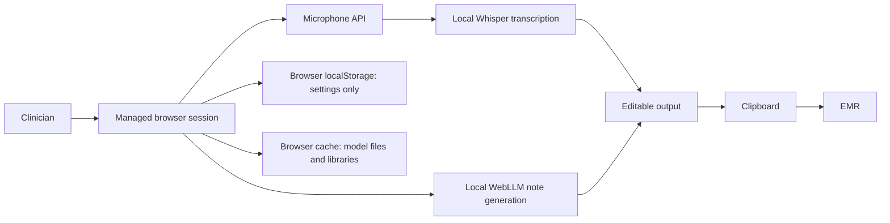

# Security and Patient Data Review

*This tool is currently in beta development. The goal is to explore what is possible, but in its current state any actual clinical use should be strictly avoided.*

Present is a static, browser-based clinical documentation assistant intended to keep clinical content on the clinician's device. This document summarizes the data flow, patient-data posture, network behavior, and recommended deployment controls for IT/security review.

This document is not legal advice. HIPAA compliance decisions should be made by the covered entity or business associate through its normal privacy, security, legal, and risk-management process.

## Executive Summary

Present is designed for on-device processing:

- Audio capture happens through the browser microphone API.
- Speech-to-text transcription runs in the browser with Transformers.js and Whisper.
- Note generation runs in the browser with WebLLM and a local WebGPU language model.
- There is no application backend, user account system, server-side database, analytics pipeline, or cloud AI inference endpoint in this repo.
- Clinical text and audio are not intentionally transmitted to the app author or to an external AI service.
- Settings are stored in browser `localStorage`; patient note content is held in page memory and copied to the clipboard for clinician use.
- The app is installable as a PWA. Its service worker caches the app shell and approved static dependency/model assets for offline local use after first setup.

For the easiest IT approval path, treat Present as a tool that may process PHI locally on an approved workstation, rather than depending on users to de-identify every dictation before use.

## Architecture Overview

## Data Flow

| Data type | Where it is created | Where it is processed | Persistence |
|---|---|---|---|
| Microphone audio | Browser microphone API | Browser memory; local Whisper pipeline | Transient page memory during recording/transcription |
| Raw transcript | Browser | Browser memory; local LLM cleanup pass | Visible/editable in page memory |
| Cleaned transcript | Browser | Browser memory; local LLM note-generation pass | Visible/editable in page memory |
| Generated note | Browser | Browser memory | Visible/editable in page memory; copied to clipboard |
| Prompt settings | Settings drawer | Browser | Stored in `localStorage` |
| Boilerplate, macros, terminology list, model choices | Settings drawer | Browser | Stored in `localStorage` |
| Model/library assets | Remote static hosts by default | Browser cache/runtime | Cached by the PWA service worker and normal browser model caches after first load |

## PHI Handling Position

Present should be evaluated as a local-use clinical documentation aid that may handle PHI on a managed endpoint.

Recommended operating rules:

- Use only on institution-approved devices, browsers, and networks.
- Do not use on shared, public, or unmanaged workstations.
- Do not place patient identifiers in persistent settings, including prompts, boilerplate, macros, or terminology lists.
- Review all generated notes before inserting them into the medical record.
- Clear the browser tab after use if local workstation policy requires clearing transient clinical content from view.
- Treat copied text according to the institution's clipboard and EMR policies.

## HIPAA and De-identification

The preferred deployment model is local PHI processing on an approved endpoint. A de-identified-only workflow can be offered as an additional policy option, but user attestation should not be the primary privacy control for routine clinical documentation.

Under HIPAA, de-identification can be achieved through either Expert Determination or Safe Harbor. Safe Harbor requires removal of 18 categories of identifiers for the individual and the individual's relatives, employers, and household members, and requires that the covered entity have no actual knowledge that the remaining information could identify the individual.

For dictated free text, Safe Harbor is difficult to guarantee because identifiers can appear in natural language. Users may accidentally include names, dates, locations, rare events, occupations, family relationships, medical record numbers, or other unique characteristics. If the organization wants a de-identified-only mode, it should combine user attestation with training, local warnings/scanning, and an institutional policy for what must be removed before use.

Reference: HHS guidance on de-identification: https://www.hhs.gov/hipaa/for-professionals/special-topics/de-identification/index.html

## Network Behavior

The application has no backend service and does not intentionally submit patient content to a server. However, the default GitHub Pages deployment loads static assets from third-party origins during first setup and whenever an uncached model/dependency is selected:

| Origin | Purpose | Patient content intentionally sent? |
|---|---|---|
| `pedscoffee.github.io` | Hosts the static app files | No |
| `esm.run` | Loads WebLLM JavaScript module | No |
| `cdn.jsdelivr.net` | Loads Transformers.js module | No |
| Model hosting/cache endpoints used by WebLLM and Transformers.js | Downloads model files | No |
| Linked documentation sites such as GitHub, WebLLM, Hugging Face | Footer/README links only | No, unless the user clicks links |

The service worker (`sw.js`) pre-caches same-origin app files and runtime-caches approved dependency/model hosts as they are requested. After the selected models finish loading once, the installed PWA can be reopened without a network connection and run from local caches.

IT teams may still want to restrict third-party runtime dependencies for supply-chain, availability, or policy reasons. For a stricter enterprise deployment, host the app, JavaScript dependencies, and model assets from an institution-controlled origin and update the import/model configuration accordingly.

## Storage Behavior

Present stores user configuration in `localStorage`, including:

- Selected LLM model.
- Selected Whisper model.
- Transcript cleanup prompt.
- Note-generation prompt.
- Medical terminology list.
- Shorthand macros.
- Boilerplate entries.
- Optional extra pipeline steps.

Patient-specific details should not be stored in those settings. The app does not intentionally store generated patient notes in `localStorage`, IndexedDB, or a remote database.

## Security Controls to Review

Recommended controls for institutional approval:

- Serve from an approved internal origin or approved static hosting environment.
- Self-host dependencies and model assets when required by policy.
- Use HTTPS.
- Install as a PWA only from a trusted HTTPS or `localhost` origin.
- Load and verify the selected model cache before relying on offline use.
- Restrict use to managed browsers/devices.
- Confirm browser WebGPU support and local model compatibility.
- Disable browser extensions that can read page content unless approved.
- Review clipboard policy for PHI.
- Consider Content Security Policy headers for enterprise hosting.
- Consider Subresource Integrity or pinned package/model versions where feasible.
- Confirm there is no analytics, tracking pixel, error-reporting SDK, or remote logging added in deployment.

## Business Associate and Cloud Notes

If PHI is sent to a cloud AI API, cloud storage service, analytics service, remote logging system, or vendor backend, that service may need to be evaluated as a HIPAA business associate and may require a Business Associate Agreement.

The current repo is designed to avoid that pattern by running transcription and note generation locally. HHS cloud guidance states that cloud service providers that create, receive, maintain, or transmit ePHI for a covered entity or business associate generally require a HIPAA-compliant BAA.

Reference: HHS HIPAA cloud computing guidance: https://www.hhs.gov/hipaa/for-professionals/special-topics/health-information-technology/cloud-computing/index.html

## Current Limitations

- The app does not provide user authentication, role-based access control, audit logs, centralized administration, or remote wipe.
- The app does not guarantee HIPAA Safe Harbor de-identification.
- The app does not detect all PHI in free text.
- Browser extensions, OS clipboard managers, screen recording tools, and endpoint compromise are outside the app's control.
- New or changed model choices require reconnecting once so those assets can be downloaded and cached.
- Model files and third-party JavaScript are loaded from external origins during first setup in the default GitHub Pages deployment.

## Suggested IT Approval Language

Present is a browser-based, on-device clinical documentation assistant. It is designed so PHI can remain on the clinician's managed workstation: audio capture, transcription, note generation, editing, and copying occur locally in the browser. The tool has no backend database, no patient account system, no analytics, and no cloud AI inference. For enterprise deployment, dependencies and model files can be self-hosted by the institution to avoid third-party runtime asset loading.

Present may also be used with de-identified or non-PHI examples for training and evaluation. De-identification is the user's responsibility unless an institution-approved de-identification workflow is implemented.
